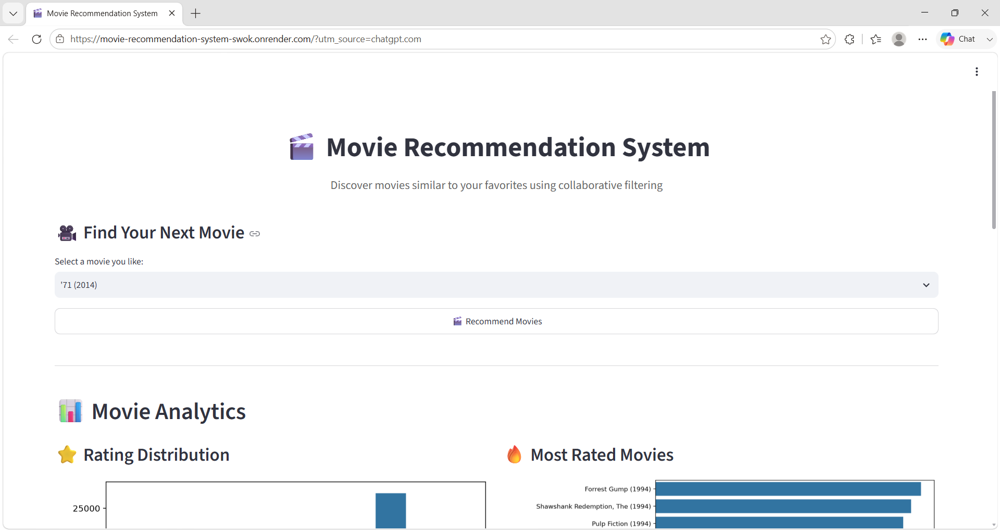
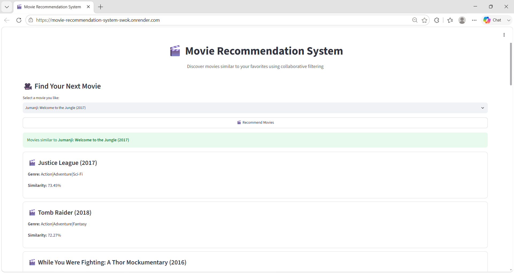
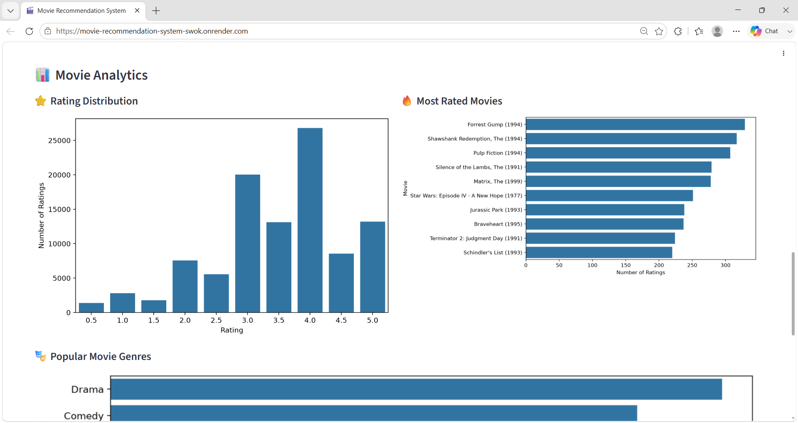
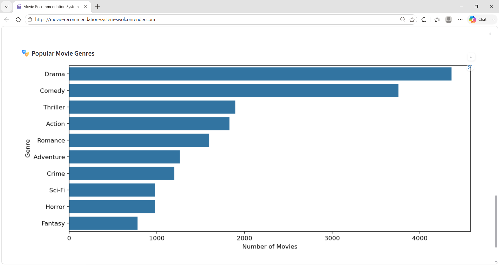

# 🎬 Movie Recommendation System

<div align="center">

### AI-Based Movie Recommendation System using Collaborative Filtering

A machine learning-powered web application that recommends movies based on user rating patterns using the MovieLens dataset and collaborative filtering.

<br>

[](https://www.python.org/)
[](https://streamlit.io/)
[](https://scikit-learn.org/)
[](https://pandas.pydata.org/)
[](https://render.com/)

<br>

**🌐 Live Demo:**  
https://movie-recommendation-system-swok.onrender.com

</div>

---

## 📌 Overview

The **Movie Recommendation System** is an end-to-end machine learning application that recommends movies similar to a movie selected by the user.

The system uses **Collaborative Filtering** to analyze user-movie rating patterns and identify movies with similar rating behavior.

The recommendation engine is built using **K-Nearest Neighbors (KNN)** with **Cosine Similarity** and is deployed as an interactive **Streamlit** web application on Render.

The application also includes a movie analytics dashboard that visualizes rating distributions and the most-rated movies in the dataset.

---

# 🖥️ Application Screenshots

## 🏠 Home Page

The application provides a clean interface where users can select their favorite movie and generate recommendations.



---

## 🎬 Movie Recommendations

After selecting a movie, the system displays movies with similar user-rating patterns along with their genres and similarity scores.



---

## 📊 Movie Analytics

The application provides visual insights into the MovieLens dataset, including rating distribution and the most-rated movies.





---

## ✨ Key Features

### 🎬 Movie Recommendations

- Select a movie from the available MovieLens dataset.
- Generate similar movie recommendations.
- Display recommended movie titles.
- Display movie genres.
- Display similarity percentages.
- Uses collaborative filtering rather than simple genre matching.

### 📊 Movie Analytics

The application provides interactive analytics including:

- ⭐ Rating Distribution
- 🔥 Most Rated Movies
- 📈 Number of ratings across movies
- 🎭 Movie genre information

### ⚡ Machine Learning

- User-Movie Rating Matrix
- Collaborative Filtering
- K-Nearest Neighbors
- Cosine Similarity
- Similarity-based movie ranking

### 🌐 Deployment

- Streamlit web application
- Deployed on Render
- Publicly accessible live demo

---

# 🧠 Machine Learning Approach

The recommendation system follows a collaborative filtering approach.

### System Pipeline

```text
                 MovieLens Dataset
                        │
                        ▼
              Data Loading & Cleaning
                        │
                        ▼
              User-Movie Rating Matrix
                        │
                        ▼
               Missing Value Handling
                        │
                        ▼
             Movie-User Matrix Creation
                        │
                        ▼
               Cosine Similarity
                        │
                        ▼
              K-Nearest Neighbors
                        │
                        ▼
              Similar Movie Search
                        │
                        ▼
             Ranked Recommendations
                        │
                        ▼
               Streamlit Web App

--------------------------


## 👩‍💻 Author

### **Shravani Kamble**

**AI & Machine Learning Engineer | Python Developer**

- 💼 **LinkedIn:** [Shravani Kamble](https://www.linkedin.com/in/shravani-kamble-9b9345346/)
- 🐙 **GitHub:** [Shraaavani](https://github.com/Shraaavani)

**Skills:** Python • Machine Learning • NLP • Computer Vision • FastAPI • Flask • Streamlit • React.js • SQL • Git

---

⭐ **If you found this project useful, consider giving it a star!**
